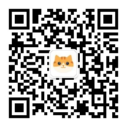

# Sugo 保护工具 - Sugo Protector

<p align="center">
  <b>下一代二进制文件保护解决方案</b><br>
  <a href="https://sugo.meowstack.com/">Sugo Protector官网</a> · 
  <a href="https://meowstack.com/">喵栈科技</a>
</p>

---

## 项目简介

**Sugo Protector** 是由喵栈科技 (MeowStack) 研发的专业级二进制文件保护工具，提供全面的代码保护功能。

支持多平台，多种文件格式，为软件开发者提供强大的知识产权保护能力。

### 核心特性

- **多平台支持**
- - Windows (PE - x86 / x64 / ARM / ARM64)
  - .NET (PE - x86 / x64 / AnyCPU)
  - Linux / Android (ELF - x86 / x64 / ARM / ARM64)
- **移动端保护** - Android APK、AAB全面支持
- **高级混淆** - 控制流混淆、常量加密、代码变形
- **GUI & CLI** - 图形界面和命令行双模式

---

## 版本类型

| 版本 | 说明 |
|------|------|
| **Enterprise** | 企业版 - 定制方案 |
| **Professional** | 专业版 - 高级保护 |
| **Trial** | 试用版 - 时间限制 |

---

## Roadmap

### Phase 1: 基础功能完善

- [x] PE/.NET 文件保护
- [x] ELF 文件保护  
- [x] APK 文件保护
- [x] GUI 界面
- [x] 命令行工具

### Phase 2: 指令混淆

- [x] x86/x64 指令混淆保护
- [x] ARM/ARM64 指令混淆保护
- [x] x86/x64 指令虚拟化保护
- [x] ARM/ARM64 指令虚拟化保护
- [x] .NET IL 指令混淆保护

### Phase 3: 移动端保护功能完善

- [x] DEX 指令混淆保护
- [ ] DEX 指令虚拟化保护
- [ ] 鸿蒙 应用保护支持
- [ ] iOS 应用保护支持
- [ ] Android 资源保护支持
- [ ] Android 防篡改支持
- [x] Android 防截屏支持
- [ ] Android 证书签名校验支持

### Phase 4: 高级保护

- [x] 反调试增强
- [x] 反Hook增强
- [x] 虚拟机检测
- [x] 运行时完整性验证
- [ ] 白盒密码学集成
- [ ] 代码水印技术

### Phase 5: 企业级功能

- [ ] 批量保护支持
- [ ] 配置文件模板系统
- [ ] CI/CD 集成插件
- [ ] 保护报告生成

### Phase 6: 平台扩展

- [x] Window 支持
- [ ] Linux 支持
- [ ] macOS (Mach-O) 支持
- [ ] 云保护方案

---

## 系统要求

### 支持平台

| 平台 | 架构 | 状态 |
|------|------|------|
| Windows | x64 | ✅ 支持 |
| Linux | x64 | 🚧 开发中 |
| macOS | Silicon | 🚧 开发中 |

---

## 快速开始

### 命令行使用

```bash
# 保护 Windows PE 文件
SGProtect_Con.exe -i input.exe -o output.exe

# 保护 Linux ELF 文件
./SGProtect_Con -i input.so -o output.so

# 保护 Android APK
SGProtect_Con.exe -i app.apk -o app_protected.apk
```

---

## 许可证

Copyright © 2025 MeowStack. All rights reserved.

本软件为商业软件，未经授权禁止复制、分发或修改。

---

## 联系我们

- **官网**: [https://sugo.meowstack.com/](https://sugo.meowstack.com/)
- **公司**: [https://meowstack.com/](https://meowstack.com/)
- **微信公众号**: 
